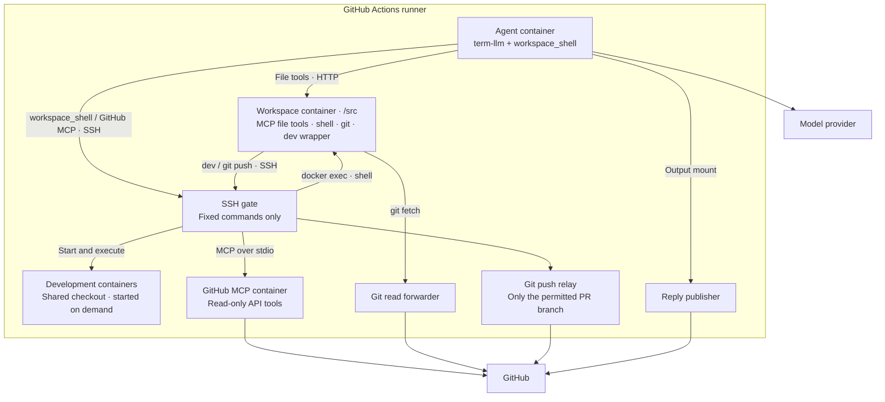

# Workflow Agent

Mention a bot on a GitHub issue or pull request to ask questions, review code, or make changes. Powered by [term-llm](https://github.com/samsaffron/term-llm), using your model credentials and GitHub Actions.

## Get started

Add a model credential as a repository secret, then save this as `.github/workflows/agent.yml` on your **default branch**:

```yaml
name: Agent
on:
  issue_comment:
    types: [created]

jobs:
  respond:
    uses: davidtaylorhq/workflow-agent/.github/workflows/agent.yml@main
    permissions:
      contents: write
      pull-requests: write
      issues: write
    with:
      mention: '@mybot'
      provider: anthropic
    secrets:
      provider-env: |
        ANTHROPIC_API_KEY=${{ secrets.ANTHROPIC_API_KEY }}
```

Comment `@mybot review this PR` or `@mybot fix this and run the tests`. The bot posts progress and a reply. Follow-ups within 60 seconds reuse the session.

By default, only `OWNER`, `MEMBER`, and `COLLABORATOR` comments can instruct it. These are GitHub associations, not write permissions; set `trusted-associations: OWNER` to restrict access to the owner. Use a fresh Linux runner with Docker; the default is `ubuntu-latest`.

## Run tests and linters

For language runtimes and services, add `.github/workflow-agent/environments.yml` on your default branch:

```yaml
environments:
  - name: node
    description: Node.js tests and linting
    image: node:22-bookworm
    cmd: sleep infinity
    user: node
    mount: /src
    setup: npm ci
```

The agent runs commands such as `dev node npm test`. Each environment starts on demand, shares the checkout, and runs `setup` once. Images need Bash and a command that stays running. Without this file, the agent still has file tools, Git, and a basic shell.

## Configure

Pass these under the caller's `with:`:

| Input | Purpose |
| --- | --- |
| `mention` | Required trigger, including `@` |
| `provider` | term-llm provider or `provider:model`; omit for automatic selection |
| `term-llm-config` | Optional config file, read from your default branch |
| `environments` | Alternative path to the development environment file |
| `trusted-associations` | Who may instruct the bot |
| `agent-timeout` | Agent time limit; default `10m` |

`provider-env` accepts multiple `NAME=value` lines. For a Claude subscription, use `provider: claude-bin` with `CLAUDE_CODE_OAUTH_TOKEN` instead of the API key above.

To use a GitHub App identity and let agent pushes trigger CI, also pass `app-id` and `app-private-key` under `secrets:`. Install the app on the repository with write access to contents, issues, and pull requests. Otherwise the bot uses `GITHUB_TOKEN` and replies as `github-actions[bot]`.

See the [workflow definition](.github/workflows/agent.yml) for all inputs and defaults.

## Architecture

The agent container holds model credentials; repository operations run in separate containers. File tools use MCP over HTTP. The `workspace_shell` wrapper sends shell commands through SSH, with a ten-minute limit enforced inside the workspace. The runner controls GitHub access and publishes replies.



The agent has no checkout mount or Docker socket. Its config and SSH key are read-only mounts. Model credentials stay out of workspace and development containers; GitHub credentials stay with the runner-side services. Containers have outbound network access.
